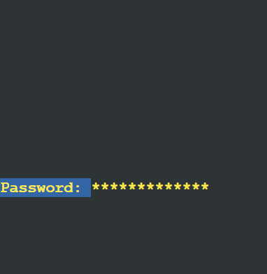

# Jarkom-Modul-2-E09-2023

|Nama Anggota |NRP |
|---|---|
|Thoriq Fatihassalam | 5025201254 |
|Farah Dhia Fadhila | 5025211030 |

## Setup config

### Pandudewanata
```
# DHCP config for Pandudewanata
auto eth0
iface eth0 inet dhcp

# Static config for Switch1
auto eth1
iface eth1 inet static
	address 10.41.1.1
	netmask 255.255.255.0


# Static config for Switch2
auto eth2
iface eth2 inet static
	address 10.41.2.1
	netmask 255.255.255.0

# Static config for Switch3
auto eth3
iface eth3 inet static
	address 10.41.3.1
	netmask 255.255.255.0
```

### Yudhistira
```
# Static config for Yudhistira
auto eth0
iface eth0 inet static
	address 10.41.1.2
	netmask 255.255.255.0
	gateway 10.41.1.1
```

### Nakula
```
# Static config for Nakula
auto eth0
iface eth0 inet static
	address 10.41.1.3
	netmask 255.255.255.0
	gateway 10.41.1.1
```

### Werkudara
```
# Static config for Werkudara
auto eth0
iface eth0 inet static
	address 10.41.2.2
	netmask 255.255.255.0
	gateway 10.41.2.1
```

### Sadewa
```
# Static config for Sadewa
auto eth0
iface eth0 inet static
	address 10.41.2.3
	netmask 255.255.255.0
	gateway 10.41.2.1
```

### Prabukusuma
```
# Static config for Prabukusuma
auto eth0
iface eth0 inet static
	address 10.41.3.2
	netmask 255.255.255.0
	gateway 10.41.3.1
```

### Abimanyu
```
# Static config for Abimanyu
auto eth0
iface eth0 inet static
	address 10.41.3.3
	netmask 255.255.255.0
	gateway 10.41.3.1
```

### Wisanggeni
```
# Static config for Wisanggeni
auto eth0
iface eth0 inet static
	address 10.41.3.4
	netmask 255.255.255.0
	gateway 10.41.3.1
```

### Arjuna
```
# Static config for Arjuna
auto eth0
iface eth0 inet static
	address 10.41.3.5
	netmask 255.255.255.0
	gateway 10.41.3.1
```

## Inisialisasi
Sebelum memulai, perlu dilakukan inisialisasi pada setiap node di `/root/.bashrc` berupa nameserver dan installment yang dibutuhkan.

### Pandudewanata
```
iptables -t nat -A POSTROUTING -o eth0 -j MASQUERADE -s 10.41.0.0/16
echo 'nameserver 192.168.122.1' > /etc/resolv.conf
```

### Yudhistira
```
echo nameserver 192.168.122.1 > /etc/resolv.conf

apt-get update
apt-get install bind9 -y
apt-get install apache2 -y
apt-get install libapache2-mod-php7.2 -y
service apache2 start
apt-get install php -y
```

### Nakula
```
echo '
nameserver 10.41.1.2
nameserver 10.41.2.2
nameserver 192.168.122.1
'  > /etc/resolv.conf

apt-get update
apt-get install dnsutils -y
apt-get install lynx -y
apt-get install apache2 -y
apt-get install libapache2-mod-php7.0 -y
service apache2 start
```

### Werkudara
```
echo nameserver 192.168.122.1 > /etc/resolv.conf

apt-get update
apt-get install bind9 -y
```

### Sadewa
```
echo '
nameserver 10.41.1.2
nameserver 10.41.2.2
nameserver 192.168.122.1
'  > /etc/resolv.conf

apt-get update
apt-get install dnsutils -y
apt-get install lynx -y
apt-get install apache2 -y
apt-get install libapache2-mod-php7.0 -y
service apache2 start
```

### Prabukusuma
```
echo nameserver 192.168.122.1 > /etc/resolv.conf

apt-get update
apt install nginx php php-fpm -y
apt-get install lynx -y
```

### Abimanyu
```
echo nameserver 192.168.122.1 > /etc/resolv.conf

apt-get update
apt install nginx php php-fpm -y
apt-get install dnsutils -y
apt-get install lynx -y
apt-get install nginx -y
service nginx start
apt-get install apache2 -y
apt-get install libapache2-mod-php7.2 -y
service apache2 start
```

### Wisanggeni
```
echo nameserver 192.168.122.1 > /etc/resolv.conf

apt-get update
apt install nginx php php-fpm -y
apt-get install lynx -y &$
```

### Arjuna
```
echo nameserver 192.168.122.1 > /etc/resolv.conf
apt-get update
apt install nginx php php-fpm -y
```

## Nomor 1
Yudhistira akan digunakan sebagai DNS Master, Werkudara sebagai DNS Slave, Arjuna merupakan Load Balancer yang terdiri dari beberapa Web Server yaitu Prabakusuma, Abimanyu, dan Wisanggeni. Buatlah topologi dengan pembagian sebagai berikut. Topologi nomor 1.

### Jawaban


### Output
Melakukan testing apakah sudah tersambung dengan koneksi internet. </br>

```
ping google.com -c 5
```


## Nomor 2

Buatlah website utama pada node Arjuna dengan akses ke arjuna.yyy.com dengan alias www.arjuna.yyy.com dengan yyy merupakan kode kelompok

### Jawaban

Pertama masukkan IP DNS untuk menyambungkan ke internet</br>

```
echo nameserver 192.168.122.1 > /etc/resolv.conf
```

Lalu menginstall bind9

```
apt-get update
apt-get install bind9 -y
```

Lalu masuk ke file `/etc/bind/named.conf.local` dan isi file dengan kode di bawah

```
zone "arjuna.e09.com" {
    type master;
    file "/etc/bind/jarkom/arjuna.e09.com";
};
```

Buat folder jarkom dengan `mkdir -p /etc/bind/jarkom` dan copy file ke arjuna.e09.com

```
cp -p /etc/bind/db.local /etc/bind/jarkom/arjuna.e09.com
```

Masuk ke dalam file `arjuna.e09.com` dan ubah localhost menjadi `arjuna.e09.com`, masukkan IP Arjuna, dan jangan lupa menambahkan CNAME berupa www sehingga kode di dalam file menjadi seperti berikut. </br>
```
;
; BIND data file for local loopback interface
;
\$TTL    604800
@       IN      SOA     arjuna.e09.com. root.arjuna.e09.com. (
                            2         ; Serial
                        604800         ; Refresh
                        86400         ; Retry
                        2419200         ; Expire
                        604800 )       ; Negative Cache TTL
;
@       IN      NS      arjuna.e09.com.
@       IN      A       10.41.3.5 ; IP Arjuna
www     IN      CNAME   arjuna.e09.com.
@       IN      AAAA    ::1
```

Jangan lupa melakukan restart bind9 dengan

```
service bind9 restart
```

### Output

Melakukan testing `ping www.arjuna.e09.com` di client Nakula


## Nomor 3

Dengan cara yang sama seperti soal nomor 2, buatlah website utama dengan akses ke abimanyu.yyy.com dan alias www.abimanyu.yyy.com

### Jawaban

Buka file `/etc/bind/named.conf.local` dan tambahkan kode berikut

```
zone "abimanyu.e09.com" {
        type master;
        file "/etc/bind/jarkom/abimanyu.e09.com";
};
```

Copy file `/etc/bind/db.local` ke abimanyu.e09.com</br>

```
cp -p /etc/bind/db.local /etc/bind/jarkom/abimanyu.e09.com
```

Buka file `abimanyu.e09.com` dalam folder jarkom dan ubah localhost menjadi `abimanyu.e09.com`, masukkan IP Abimanyu, dan jangan lupa menambahkan CNAME berupa www sehingga kode di dalam file menjadi seperti berikut.</br>
```
;
; BIND data file for local loopback interface
;
$TTL    604800
@       IN      SOA     abimanyu.e09.com. root.abimanyu.e09.com. (
                                2         ; Serial
                           604800         ; Refresh
                            86400         ; Retry
                            2419200         ; Expire
                            604800 )       ; Negative Cache TTL
;
@       IN      NS      abimanyu.e09.com.
@       IN      A       10.41.3.3 ; IP Abimanyu
www     IN      CNAME   abimanyu.e09.com.
@       IN      AAAA    ::1
```

Jangan lupa melakukan restart bind9 dengan

```
service bind9 restart
```

### Output

Melakukan testing `ping www.abimanyu.e09.com` di client Nakula


## Nomor 4

Kemudian, karena terdapat beberapa web yang harus di-deploy, buatlah subdomain parikesit.abimanyu.yyy.com yang diatur DNS-nya di Yudhistira dan mengarah ke Abimanyu.

### Jawaban

Pada file `/etc/bind/jarkom/abimanyu.e09.com` tambahkan subdomain `parikesit` yang mengarah ke IP Arjuna sehingga kode di dalam file tersebut menjadi seperti berikut. </br>
```
;
; BIND data file for local loopback interface
;
$TTL    604800
@       IN      SOA     abimanyu.e09.com. root.abimanyu.e09.com. (
                                2         ; Serial
                           604800         ; Refresh
                            86400         ; Retry
                            2419200         ; Expire
                            604800 )       ; Negative Cache TTL
;
@       IN      NS      abimanyu.e09.com.
@       IN      A       10.41.3.3 ; ip arjuna
www     IN      CNAME   abimanyu.e09.com.
parikesit IN    A       10.41.3.3 ;
@       IN      AAAA    ::1
```

Jangan lupa melakukan restart bind9.

```
service bind9 restart
```

### Output

Melakukan testing `ping parikesit.abimanyu.e09.com` di client.


## Nomor 5

Buat juga reverse domain untuk domain utama. (Abimanyu saja yang direverse)

### Jawaban

Untuk me-reverse Abimanyu, kita perlu mengetahui IP dari Abimanyu yaitu `10.41.3.3` dan kita perlu me-reverse IP tersebut menjadi `3.3.41.10`.

Pada node **_Yudhistira_** buka file `/etc/bind/named.conf.local` dan tambahkan kode berikut.

```
zone "3.41.10.in-addr.arpa" {
        type master;
        file "/etc/bind/jarkom/3.41.10.in-addr.arpa";
};
```

Copy file db.local ke (3-digit-IP-Abimanyu-direverse).in-addr.arpa

```
cp -p /etc/bind/db.local /etc/bind/jarkom/3.41.10.in-addr.arpa
```

Masuk ke file `3.41.10.in-addr.arpa`pada folder jarkom dan ubah kode menjadi seperti berikut.
```
;
; BIND data file for local loopback interface
;
$TTL    604800
@       IN      SOA     abimanyu.e09.com. root.abimanyu.e09.com. (
                                2         ; Serial
                           604800         ; Refresh
                            86400         ; Retry
                            2419200         ; Expire
                            604800 )       ; Negative Cache TTL
;
1.41.10.in-addr.arpa.      IN      NS      abimanyu.e09.com.
2                          IN      PTR       abimanyu.e09.com.
```

Jangan lupa melakukan restart bind9.

```
service bind9 restart
```

Pada node client (Nakula), install package berikut

```
apt-get update && apt-get install dnsutils
```

### Output
Melakukan testing `host -t PTR 10.41.1.2` di client Nakula


## Nomor 6

Agar dapat tetap dihubungi ketika DNS Server Yudhistira bermasalah, buat juga Werkudara sebagai DNS Slave untuk domain utama.

### Jawaban

Pada node **_Yudhistira_** masuk ke file `/etc/bind/named.conf.local` dan ubah zona `abimanyu.e09.com` menjadi seperti berikut. Jangan lupa untuk menambahkan IP Werkudara untuk `also-notify` dan `allow-transfer`

```
zone "abimanyu.e09.com" {
    type master;
    notify yes;
    also-notify {10.41.2.2;};
    allow-transfer {10.41.2.2;};
    file "/etc/bind/jarkom/abimanyu.e09.com";
};
```

Melakukan restart bind9 dengan

```
service bind9 restart
```

Pada node **_Werkudara_** masukkan IP DNS untuk menyambungkan ke internet

```
echo nameserver 192.168.122.1 > /etc/resolv.conf
```

Lalu install bind9.

```
apt-get update && apt-get install bind9 -y
```

Masuk ke dalam file `/etc/bind/named.conf.local` dan masukkan kode berikut. Jangan lupa memasukkan IP Yudhistira pada masters yang menandakan Yudhistira merupakan DNS masternya.

```
zone "abimanyu.e09.com" {
    type slave;
    masters { 10.41.1.2; };
    file "/var/lib/bind/abimanyu.e09.com";
};
```

Melakukan restart bind9 dengan

```
service bind9 restart
```

di **_Yudhistira_** matikan bind9 dengan `service bind9 stop`


## Output

Ketika server Yudhistira dimatikan, coba melakukan testing `ping www.abimanyu.e09.com -c 5` di client Nakula.


## Nomor 7

Seperti yang kita tahu karena banyak sekali informasi yang harus diterima, buatlah subdomain khusus untuk perang yaitu baratayuda.abimanyu.yyy.com dengan alias www.baratayuda.abimanyu.yyy.com yang didelegasikan dari Yudhistira ke Werkudara dengan IP menuju ke Abimanyu dalam folder Baratayuda.

### Jawaban

Pada node **_Yudhistira_**, buka file `/etc/bind/jarkom/abimanyu.e09.com` dan tambahkan `ns1 IN A 10.41.3.3` dengan catatan IP yang dimasukkan adalah milik Werkudara sehingga kode menjadi seperti berikut.</br>
```
;
; BIND data file for local loopback interface
;
$TTL    604800
@       IN      SOA     abimanyu.e09.com. root.abimanyu.e09.com. (
                                2         ; Serial
                           604800         ; Refresh
                            86400         ; Retry
                            2419200         ; Expire
                            604800 )       ; Negative Cache TTL
;
@               IN      NS      abimanyu.e09.com.
@               IN      A       10.41.3.3 
www             IN      CNAME   abimanyu.e09.com.
parikesit       IN    A       10.41.3.3 ;
ns1             IN      A       10.41.2.2 
baratayuda      IN      NS      ns1 
@               IN      AAAA    ::1
```

Lalu masuk ke file `/etc/bind/named.conf.options` dan comment `dnssec-validation auto;` dan tambahkan `allow-query{any;};` sehingga kode menjadi seperti berikut.

```
options {
        directory "/var/cache/bind";
        // forwarders {
        //      0.0.0.0;
        // };
        //dnssec-validation auto;
        allow-query{any;};
        auth-nxdomain no;    # conform to RFC1035
        listen-on-v6 { any; };
};
```

Lalu restart bind9 dengan `service bind9 restart`

Pada node **_Werkudara_** buka file `/etc/bind/named.conf.options` dan tambahkan `allow-query{any;};` dan juga comment `dnssec-validation auto;`

Masuk ke dalam file `/etc/bind/named.conf.local` masukkan kode

```
zone "baratayuda.abimanyu.e09.com" {
    type master;
    file "/etc/bind/baratayuda/baratayuda.abimanyu.e09.com";
};
```

untuk mengarahkan zone ke DNS master agar authoritative dapat berjalan. Lalu buat folder baratayuda dengan `mkdir -p /etc/bind/baratayuda`

copy file ke baratayuda.abimanyu.e09.com dengan

```
cp /etc/bind/db.local /etc/bind/baratayuda/baratayuda.abimanyu.e09.com
```

dan pada file baratayuda.abimanyu.e09.com ubah localhost menjadi `baratayuda.abimanyu.e09.com` dan masukkan IP Abimanyu, sehingga kode menjadi seperti berikut.
```
;
; BIND data file for local loopback interface
;
$TTL    604800
@       IN      SOA     baratayuda.abimanyu.e09.com. root.baratayuda.abimanyu.e09.com. (
                              2         ; Serial
                         604800         ; Refresh
                          86400         ; Retry
                        2419200         ; Expire
                         604800 )       ; Negative Cache TTL
;
@       IN      NS      baratayuda.abimanyu.e09.com.
@       IN      A       10.41.3.3 ; ip abimanyu
www     IN      CNAME   baratayuda.abimanyu.e09.com.
```

Jangan lupa restart bind9 dengan `service bind9 restart`

### Output

Melakukan testing `ping www.baratayuda.abimanyu.e09.com -c 5` di client Nakula.


## Nomor 8

Untuk informasi yang lebih spesifik mengenai Ranjapan Baratayuda, buatlah subdomain melalui Werkudara dengan akses rjp.baratayuda.abimanyu.yyy.com dengan alias www.rjp.baratayuda.abimanyu.yyy.com yang mengarah ke Abimanyu.

### Jawaban

Pada nomor 8 kita hanya perlu menambahkan subdomain rjp pada db.local di werkudara sehingga kode menjadi seperti berikut.
```
;
; BIND data file for local loopback interface
;
$TTL    604800
@       IN      SOA     baratayuda.abimanyu.e09.com. root.baratayuda.abimanyu.e09.com. (
                              2         ; Serial
                         604800         ; Refresh
                          86400         ; Retry
                        2419200         ; Expire
                         604800 )       ; Negative Cache TTL
;
@       IN      NS      baratayuda.abimanyu.e09.com.
@       IN      A       10.41.3.3 ; IP Abimanyu
www     IN      CNAME   baratayuda.abimanyu.e09.com.
rjp     IN      A       10.41.3.3
www     IN      CNAME   rjp.baratayuda.abimanyu.e09.com.
```

### Output

Melakukan testing `ping www.rjp.baratayuda.e09.com -c 5` di client Nakula.


## Nomor 9

Arjuna merupakan suatu Load Balancer Nginx dengan tiga worker (yang juga menggunakan nginx sebagai webserver) yaitu Prabakusuma, Abimanyu, dan Wisanggeni. Lakukan deployment pada masing-masing worker.

### Jawaban

Perlu install nginx dan php di load balancer dan juga 3 workernya, pada workernya perlu ditambahkan installment lynx. semua sudah dilakukan pada saat inisialisasi.

Pada node Arjuna (load balancer) perlu membuat load balancing dengan metode Round Robin yaitu urutannya berdasarkan urutan IP dari kecil ke besar. saya menamai file lb-jarkom pada folder /etc/nginx/sites-available kode akan seperti di bawah

```
 # Default menggunakan Round Robin
 upstream myweb  {
 	server 10.41.3.2; #IP Prabukusuma
	server 10.41.3.3; #IP Abimanyu
 	server 10.41.3.4; #IP Wisanggeni
}

 server {
 	listen 80;
 	server_name arjuna.e09.com www.arjuna.e09.com;

 	location / {
 	proxy_pass http://myweb;
 	}
 }
```

server menggunakan arjuna.e09.com dan bisa diakses melalui www.arjuna.e09.com, proxy saya menggunakan nama upstream yaitu myweb.

Lalu melakukan symlink dengan `ln -s /etc/nginx/sites-available/lb-jarkom /etc/nginx/sites-enabled/lb-jarkom` berguna untuk menyinkrosinasikan setiap perubahan agar sama untuk kedua file tersebut.

Lalu hapus file default pada folder sites-available di nginx `rm /etc/nginx/sites-enabled/default`, dan terakhir jangan lupa untuk restart nginx setiap kali melakukan perubahan pada konfigurasi.

Pada worker (Prabukusuma, Abimanyu, dan Wisanggeni) pertama perlu download filezip dahulu.

```
apt-get install wget -y
apt-get install unzip -y
wget --no-check-certificate 'https://drive.google.com/uc?id=17tAM_XDKYWDvF-JJix1x7txvTBEax7vX' -O arjuna.yyy.com.zip
unzip arjuna.yyy.com.zip -d /var/www
mv /var/www/arjuna.yyy.com /var/www/arjuna.e09.com
rm arjuna.yyy.com.zip
```

Lalu menyalakan php dengan `service php7.2-fpm start`

Setup konfigurasi pada server block jarkom

```
server {
    listen 80;

    root /var/www/jarkom;
    index index.php index.html index.htm;

    server_name _;

    location / {
            try_files $uri $uri/ /index.php?$query_string;
    }

    location ~ \.php$ {
            include snippets/fastcgi-php.conf;
            fastcgi_pass unix:/run/php/php7.2-fpm.sock;
    }

    location ~ /\.ht {
            deny all;
    }
    error_log /var/log/nginx/jarkom_error.log;
    access_log /var/log/nginx/jarkom_access.log;
}
```

Melakukan symlink dengan kode berikut

```
ln -s /etc/nginx/sites-available/jarkom /etc/nginx/sites-enabled/jarkom
```

Menghapus file default pada sites-enabled `rm /etc/nginx/sites-enabled/default` dan restart nginx `service nginx restart`

### Output
Melakukan testing berikut di client Nakula

```
lynx http://10.41.3.2
lynx http://10.41.3.3
lynx http://10.41.3.4
lynx http://arjuna.e09.com
```
Prabukusuma (http://10.41.3.2) </br>
</br>

Abimanyu (http://10.41.3.3)</br>
</br>

Wisanggeni (http://10.41.3.4)</br>
</br>

Arjuna (http://arjuna.e09.com) </br>


## Nomor 10

Kemudian gunakan algoritma Round Robin untuk Load Balancer pada Arjuna. Gunakan server_name pada soal nomor 1. Untuk melakukan pengecekan akses alamat web tersebut kemudian pastikan worker yang digunakan untuk menangani permintaan akan berganti ganti secara acak. Untuk webserver di masing-masing worker wajib berjalan di port 8001-8003. Contoh - Prabakusuma:8001 - Abimanyu:8002 - Wisanggeni:8003

### Jawaban

Hanya perlu menambahkan port 8001-8003 pada setiap worker dan pada upstream-nya.

Pada node arjuna

```
 # Default menggunakan Round Robin
 upstream myweb  {
 	server 10.41.3.2:8001; #IP prabukusuma
	server 10.41.3.3:8002; #IP abimanyu
 	server 10.41.3.4:8003; #IP wisanggeni
}

 server {
 	listen 80;
 	server_name arjuna.e09.com www.arjuna.e09.com;

 	location / {
 	proxy_pass http://myweb;
 	}
 }
```

Pada setiap worker

```
server {
    listen 800X;

    root /var/www/jarkom;
    index index.php index.html index.htm;

    server_name _;

    location / {
            try_files $uri $uri/ /index.php?$query_string;
    }

    location ~ \.php$ {
            include snippets/fastcgi-php.conf;
            fastcgi_pass unix:/run/php/php7.2-fpm.sock;
    }

    location ~ /\.ht {
            deny all;
    }
    error_log /var/log/nginx/jarkom_error.log;
    access_log /var/log/nginx/jarkom_access.log;
}
```

### Output

Melakukan testing berikut di client Nakula.

```
lynx http://10.41.3.2:8001
lynx http://10.41.3.3:8002
lynx http://10.41.3.4:8003
lynx http://arjuna.e09.com
```
Prabukusuma (http://10.41.3.2:8001) </br>
</br>

Abimanyu (http://10.41.3.3:8002) </br>
</br>

Wisanggeni (http://10.41.3.4:8003) </br>
</br>

Arjuna (http://arjuna.e09.com) </br>


## Nomor 11
Selain menggunakan Nginx, lakukan konfigurasi Apache Web Server pada worker Abimanyu dengan web server www.abimanyu.yyy.com. Pertama dibutuhkan web server dengan DocumentRoot pada /var/www/abimanyu.yyy

### Jawaban
Pada node **_Yudhistira_** perlu setting konfigurasi file bind9 menjadi seperti berikut.</br>
```
; BIND data file for local loopback interface
;
$TTL    604800
@       IN      SOA     abimanyu.e09.com. root.abimanyu.e09.com. (
                        2             ; Serial
                         604800         ; Refresh
                          86400         ; Retry
                        2419200         ; Expire
                         604800 )       ; Negative Cache TTL
;
@               IN      NS      abimanyu.e09.com.
@               IN      A       10.41.3.3     ; IP abimanyu
www             IN      CNAME   abimanyu.e09.com.
parikesit       IN      A       10.41.3.3     ; IP abimanyu
ns1             IN      A       10.41.2.2     ; IP werkudara
baratayuda      IN      NS      ns1
```

Jangan lupa untuk restart bind9 karena adanya perubahan pada file tersebut.

Pada node **_Abimanyu_**, kita perlu download file yang dibutuhkan terlebih dahulu dengan command berikut.

```
apt-get install wget -y
wget -O '/var/www/abimanyu.e09.com' 'https://drive.google.com/file/d/1a4V23hwK9S7hQEDEcv9FL14UkkrHc-Zc/view?usp=drive_link'
unzip -o /var/www/abimanyu.e09.com -d /var/www/
mv /var/www/abimanyu.yyy.com /var/www/abimanyu.e09
rm /var/www/abimanyu.e09.com
rm -rf /var/www/abimanyu.yyy.com
```

kita perlu copy file `000-default.conf` dan menamakannya `abimanyu.e09.com.conf`, lalu hapus file defaultnya.

Masuk ke dalam file `/etc/apache2/sites-available/abimanyu.e09.com` dan atur konfigurasi menjadi seperti berikut.

```
<VirtualHost *:80>
  ServerAdmin webmaster@localhost
  DocumentRoot /var/www/abimanyu.e09
  ServerName abimanyu.e09.com
  ServerAlias www.abimanyu.e09.com

  ErrorLog ${APACHE_LOG_DIR}/error.log
  CustomLog ${APACHE_LOG_DIR}/access.log combined
</VirtualHost>
```

DocumentRoot kita arahkan ke folder `/var/www/abimanyu.e09` dan juga mengatur ServerName dan ServeraAlias agar bisa menggunakan www.

Jangan lupa untuk melakukan `a2ensite abimanyu.e09.com.conf` untuk mengaktifkan situs web yang sudah dikonfigurasi pada file `abimanyu.e09.com.conf`

Terakhir, lakukan restart apache2 karena terdapat perubahan.

```
service apache2 restart
```

### Output

Melakukan testing `lynx abimanyu.e09.com` di client Nakula


## Nomor 12

Setelah itu ubahlah agar url www.abimanyu.yyy.com/index.php/home menjadi www.abimanyu.yyy.com/home.

### Jawaban

Kita perlu menambahkan `<Directory></Directory>` yang melakukan rewrite index untuk menambahkan Alias yang akan men-direct ke index tertentu.

Buka file `/etc/apache2/sites-available/abimanyu.e09.com` dan tambahkan `Directory` sehingga kode akan menjadi seperti berikut.

```
<VirtualHost *:80>
  ServerAdmin webmaster@localhost
  DocumentRoot /var/www/abimanyu.e09
  ServerName abimanyu.e09.com
  ServerAlias www.abimanyu.e09.com

   <Directory /var/www/abimanyu.e09.com/index.php/home>
     Options +Indexes
    </Directory>

    Alias "/home" "/var/www/abimanyu.e09.com/index.php/home"

  ErrorLog ${APACHE_LOG_DIR}/error.log
  CustomLog ${APACHE_LOG_DIR}/access.log combined
</VirtualHost>
```

Setelah itu jangan lupa untuk restart apache2.

### Output

Melakukan testing `lynx abimanyu.a09.com/home` di client Nakula


## Nomor 13

Selain itu, pada subdomain www.parikesit.abimanyu.yyy.com, DocumentRoot disimpan pada /var/www/parikesit.abimanyu.yyy

### Jawaban

Pada node **Abimanyu** perlu download folder yang dibutuhkan dengan command berikut.

```
apt-get install wget -y
apt-get install unzip -y
wget -O '/var/www/parikesit.abimanyu.e09.com' 'https://drive.google.com/file/d/1LdbYntiYVF_NVNgJis1GLCLPEGyIOreS/view?usp=drive_link'
unzip -o /var/www/parikesit.abimanyu.e09.com -d /var/www/
mv /var/www/parikesit.abimanyu.yyy.com /var/www/parikesit.abimanyu.e09
rm /var/www/parikesit.abimanyu.e09.com
mkdir /var/www/parikesit.abimanyu.e09/secret
```

Lalu kita hanya perlu mengganti DocumentRoot, ServerName, dan ServerAlias pada file konfigurasi `/etc/apache2/sites-available/parikesit-abimanyu.e09.com` menjadi seperti berikut.

```
<VirtualHost *:80>
  ServerAdmin webmaster@localhost
  DocumentRoot /var/www/parikesit.abimanyu.e09
  ServerName parikesit.abimanyu.e09.com
  ServerAlias www.parikesit.abimanyu.e09.com

  ErrorLog ${APACHE_LOG_DIR}/error.log
  CustomLog ${APACHE_LOG_DIR}/access.log combined
</VirtualHost>
```

Lakukan `a2ensite parikesit.abimanyu.e09.com.conf` untuk mengaktifkan situs web yang sudah dikonfigurasi pada file `parikesit.abimanyu.e09.com.conf`

Setelah itu jangan lupa untuk restart apache2.

### Output

Melakukan testing `lynx parikesit.abimanyu.a09.com` pada client Nakula


## Nomor 14

Pada subdomain tersebut folder /public hanya dapat melakukan directory listing sedangkan pada folder /secret tidak dapat diakses (403 Forbidden).

### Jawaban

Pada node **_Abimanyu_** kita menambahkan `Options +Indexes` untuk melakukan directory listing untuk directory public, dan menggunakan `Options -Indexes` untuk directory secret yang tidak dapat diakses.

Buka file `/etc/apache2/sites-available/parikesit.abimanyu.e09.com.conf` dan tambahkan seperti yang telah disebutkan sebelumnya sehingga kode akan menjadi seperti berikut.

```
<VirtualHost *:80>
  ServerAdmin webmaster@localhost
  DocumentRoot /var/www/parikesit.abimanyu.e09
  ServerName parikesit.abimanyu.e09.com
  ServerAlias www.parikesit.abimanyu.e09.com

  <Directory /var/www/parikesit.abimanyu.e09/public>
          Options +Indexes
  </Directory>

  <Directory /var/www/parikesit.abimanyu.e09/secret>
          Options -Indexes
  </Directory>

  Alias "/public" "/var/www/parikesit.abimanyu.e09/public"
  Alias "/secret" "/var/www/parikesit.abimanyu.e09/secret"

  ErrorLog ${APACHE_LOG_DIR}/error.log
  CustomLog ${APACHE_LOG_DIR}/access.log combined
</VirtualHost>
```

Jangan lupa untuk melakukan restart pada apache2.

### Output

Melakukan testing berikut pada client Nakula

```
lynx parikesit.abimanyu.e09.com/public
lynx parikesit.abimanyu.e09.com/secret
```
Public</br>
</br>

Secret </br>
 </br>


## Nomor 15

Buatlah kustomisasi halaman error pada folder /error untuk mengganti error kode pada Apache. Error kode yang perlu diganti adalah 404 Not Found dan 403 Forbidden.

### Jawaban
Kita hanya menambahkan ErrorDocument yang akan me-redirect terhadap file html yang berisi halaman error jika saat mengakses domain terdapat suatu error tertentu.

Buka file `/etc/apache2/sites-available/parikesit.abimanyu.e09.com.conf` dan tambahkan seperti yang telah disebutkan sebelumnya sehingga kode akan menjadi seperti berikut.
```
<VirtualHost *:80>
  ServerAdmin webmaster@localhost
  DocumentRoot /var/www/parikesit.abimanyu.e09
  ServerName parikesit.abimanyu.e09.com
  ServerAlias www.parikesit.abimanyu.e09.com

  <Directory /var/www/parikesit.abimanyu.e09/public>
          Options +Indexes
  </Directory>

  <Directory /var/www/parikesit.abimanyu.e09/secret>
          Options -Indexes
  </Directory>

  Alias "/public" "/var/www/parikesit.abimanyu.e09/public"
  Alias "/secret" "/var/www/parikesit.abimanyu.e09/secret"

  ErrorDocument 404 /error/404.html
  ErrorDocument 403 /error/403.html

  ErrorLog ${APACHE_LOG_DIR}/error.log
  CustomLog ${APACHE_LOG_DIR}/access.log combined
</VirtualHost>
```
Jangan lupa untuk melakukan restart apache2

### Output
Melakukan testing berikut di client Nakula

```
lynx parikesit.abimanyu.a09.com/errortest
lynx parikesit.abimanyu.a09.com/secret
```
Error </br>
</br>
</br>

Secret </br>
</br>


## Nomor 16
Buatlah suatu konfigurasi virtual host agar file asset www.parikesit.abimanyu.yyy.com/public/js menjadi
www.parikesit.abimanyu.yyy.com/js

### Jawaban
Pada file  `/etc/apache2/sites-available/parikesit.abimanyu.e09.com.conf` tambahkan Alias `abimanyu.e09.com/public/js`yang dapat mengakses `/var/www/parikesit.abimanyu.e09/public/js`.

Sehingga kode akan menjadi seperti berikut
```
<VirtualHost *:80>
  ServerAdmin webmaster@localhost
  DocumentRoot /var/www/parikesit.abimanyu.e09
  ServerName parikesit.abimanyu.e09.com
  ServerAlias www.parikesit.abimanyu.e09.com

  <Directory /var/www/parikesit.abimanyu.e09/public>
          Options +Indexes
  </Directory>

  <Directory /var/www/parikesit.abimanyu.e09/secret>
          Options -Indexes
  </Directory>

  Alias "/public" "/var/www/parikesit.abimanyu.e09/public"
  Alias "/secret" "/var/www/parikesit.abimanyu.e09/secret"
  Alias "/js" "/var/www/parikesit.abimanyu.e09/public/js"

  ErrorDocument 404 /error/404.html
  ErrorDocument 403 /error/403.html

  ErrorLog ${APACHE_LOG_DIR}/error.log
  CustomLog ${APACHE_LOG_DIR}/access.log combined
</VirtualHost>
```
Jangan lupa untuk melakukan restart apache2

### Output

Melakukan testing `lynx parikesit.abimanyu.a09.com/js` pada client Nakula.


## Nomor 17

Agar aman, buatlah konfigurasi agar www.rjp.baratayuda.abimanyu.yyy.com hanya dapat diakses melalui port 14000 dan 14400.

### Jawaban
Pada node ***Abimanyu***, download resource yang diperlukan terlebih dahulu dengan command berikut.
```
apt-get install wget -y
apt-get install unzip -y
wget -O '/var/www/rjp.baratayuda.abimanyu.e09.com' 'https://drive.usercontent.google.com/download?id=1pPSP7yIR05JhSFG67RVzgkb-VcW9vQO6'
unzip -o /var/www/rjp.baratayuda.abimanyu.e09.com -d /var/www/
mv /var/www/rjp.baratayuda.abimanyu.yyy.com /var/www/rjp.baratayuda.abimanyu.e09
rm /var/www/rjp.baratayuda.abimanyu.e09.com
```

Buat file konfigurasi bernama `/etc/apache2/sites-available/rjp.baratayuda.abimanyu.e09.com.conf` dan ubah port pada VirtualHost menjadi 14000 dan 14400. Sehingga kode akan menjadi seperti berikut.
```
<VirtualHost *:14000 *:14400>
  ServerAdmin webmaster@localhost
  DocumentRoot /var/www/rjp.baratayuda.abimanyu.e09
  ServerName rjp.baratayuda.abimanyu.e09.com
  ServerAlias www.rjp.baratayuda.abimanyu.e09.com

  ErrorDocument 404 /error/404.html
  ErrorDocument 403 /error/403.html

  ErrorLog ${APACHE_LOG_DIR}/error.log
  CustomLog ${APACHE_LOG_DIR}/access.log combined
</VirtualHost>
```  

Setelah itu atur melakukan custom pada file `ports.conf` seperti berikut.
```
Listen 80
Listen 14000
Listen 14400

<IfModule ssl_module>
        Listen 443
</IfModule>

<IfModule mod_gnutls.c>
        Listen 443
</IfModule>
```
Jangan lupa melakukan `a2ensite rjp.baratayuda.abimanyu.e09.com.conf` untuk mengaktifkan website yang telah dikonfigurasi di file `rjp.baratayuda.abimanyu.e09.com.conf` dan melakukan restart apache2.
### Output

Melakukan testing berikut di client Nakula.

```
lynx rjp.baratayuda.abimanyu.a09.com:14000
lynx rjp.baratayuda.abimanyu.a09.com:14400
```

Kedua port akan mengeluarkan output yang sama


Jika kita memasukkan port yang berbeda akan mengeluarkan error.


## Nomor 18
Untuk mengaksesnya buatlah autentikasi username berupa “Wayang” dan password “baratayudayyy” dengan yyy merupakan kode kelompok. Letakkan DocumentRoot pada /var/www/rjp.baratayuda.abimanyu.yyy.

### Jawaban
Untuk melakukan autentifikasi pada suatu server, kita perlu menambahkan `AuthType` dan `Require Valid-User`. Kita juga perlu menambahkan `AuthUserFile` untuk tempat melakukan write data yang diperlukan untuk autentifikasi dan `AuthName` yang merupakan content-type autentifikasi pada apache2. 

Buka file `/etc/apache2/sites-available/rjp.baratayuda.abimanyu.e09.com.conf` dan ubah kode menjadi seperti berikut.
```
<VirtualHost *:14000 *:14400>
  ServerAdmin webmaster@localhost
  DocumentRoot /var/www/rjp.baratayuda.abimanyu.e09
  ServerName rjp.baratayuda.abimanyu.e09.com
  ServerAlias www.rjp.baratayuda.abimanyu.e09.com

  <Directory /var/www/rjp.baratayuda.abimanyu.e09>
          AuthType Basic
          AuthName "Restricted Content"
          AuthUserFile /etc/apache2/.htpasswd
          Require valid-user
  </Directory>

  ErrorDocument 404 /error/404.html
  ErrorDocument 403 /error/403.html

  ErrorLog ${APACHE_LOG_DIR}/error.log
  CustomLog ${APACHE_LOG_DIR}/access.log combined
</VirtualHost>
```
Jangan lupa melakukan `a2ensite rjp.baratayuda.abimanyu.e09.com.conf` untuk mengaktifkan website yang telah dikonfigurasi di file `rjp.baratayuda.abimanyu.e09.com.conf` dan melakukan restart apache2.

Masukkan command berikut
```
htpasswd -c -b /etc/apache2/.htpasswd Wayang baratayudae09
```
dengan keterangan `-c` adalah `created` dan `-b` adalah `bcrypt` agar password yang kita isi akan dilakukan hash terlebih dahulu sebelum disimpan.


### Output

Melakukan testing `lynx rjp.baratayuda.abimanyu.e09.com:14000` pada client Nakula.





## Nomor 19
Buatlah agar setiap kali mengakses IP dari Abimanyu akan secara otomatis dialihkan ke www.abimanyu.yyy.com (alias)

### Jawaban
Kita perlu menggunakan file `Redirect` yang akan mengarahkan ke file yang diinginkan agar ketika kita mengakses IP dari Abimanyu, kita dapat secara otomatis dialihkan ke www.abimanyu.e09.com. Di sini saya menggunakan file `000-default.conf` yang merupakan default dari service apache2.

Buka file `/etc/apache2/sites-available/000-default.conf` dan ubah kode menjadi seperti berikut.
```
<VirtualHost *:80>
    ServerAdmin webmaster@abimanyu.e09.com
    DocumentRoot /var/www/html

    ErrorLog ${APACHE_LOG_DIR}/error.log
    CustomLog ${APACHE_LOG_DIR}/access.log combined

    Redirect / http://www.abimanyu.e09.com/
</VirtualHost>
```

### Output
Melakukan testing `lynx 10.41.3.3` pada client Nakula.


## Nomor 20
Karena website www.parikesit.abimanyu.yyy.com semakin banyak pengunjung dan banyak gambar gambar random, maka ubahlah request gambar yang memiliki substring “abimanyu” akan diarahkan menuju abimanyu.png.

### Jawaban
Pada node ***Abimanyu*** kita menggunakan `rewrite modul` dengan menjalankan command `a2enmod rewrite`. Lalu kita melakukan rewrite ke directory `parikesit.abimanyu.e09`. 

Buka file `/var/www/parikesit.abimanyu.e09/.htaccess` dan masukkan kode berikut.
```
RewriteEngine On
RewriteCond %{REQUEST_URI} ^/public/images/(.*)(abimanyu)(.*\.(png|jpg))
RewriteCond %{REQUEST_URI} !/public/images/abimanyu.png
RewriteRule abimanyu http://parikesit.abimanyu.e09.com/public/images/abimanyu.png$1 [L,R=301]
```

Dan ubah file `parikesit.abimanyu.e09.com.conf` menjadi seperti berikut.
```
<VirtualHost *:80>
  ServerAdmin webmaster@localhost
  DocumentRoot /var/www/parikesit.abimanyu.e09

  ServerName parikesit.abimanyu.e09.com
  ServerAlias www.parikesit.abimanyu.e09.com

  <Directory /var/www/parikesit.abimanyu.e09/public>
          Options +Indexes
  </Directory>

  <Directory /var/www/parikesit.abimanyu.e09/secret>
          Options -Indexes
  </Directory>

  <Directory /var/www/parikesit.abimanyu.e09>
          Options +FollowSymLinks -Multiviews
          AllowOverride All
  </Directory>

  Alias "/public" "/var/www/parikesit.abimanyu.e09/public"
  Alias "/secret" "/var/www/parikesit.abimanyu.e09/secret"
  Alias "/js" "/var/www/parikesit.abimanyu.e09/public/js"

  ErrorDocument 404 /error/404.html
  ErrorDocument 403 /error/403.html

  ErrorLog ${APACHE_LOG_DIR}/error.log
  CustomLog ${APACHE_LOG_DIR}/access.log combined
</VirtualHost>
```
Jangan lupa melakukan restart apache2 karena telah dilakukan perubahan pada file konfigurasi.

### Output
Melakukan testing `lynx parikesit.abimanyu.e09.com/public/images/not-abimanyu.png` pada client Nakula.


## Kendala
Terdapat kendala pada saat praktikum yaitu internet yang tidak stabil yang membuat mudahnya `connection closed` dan `connection lost` pada GNS3. Dikarenakan koneksi yang terputus itu, ketika koneksi disambungkan kembali, konfigurasi pada GNS3 menghilang dan membutuhkan banyak waktu untuk mengisi konfigurasi dari awal.
